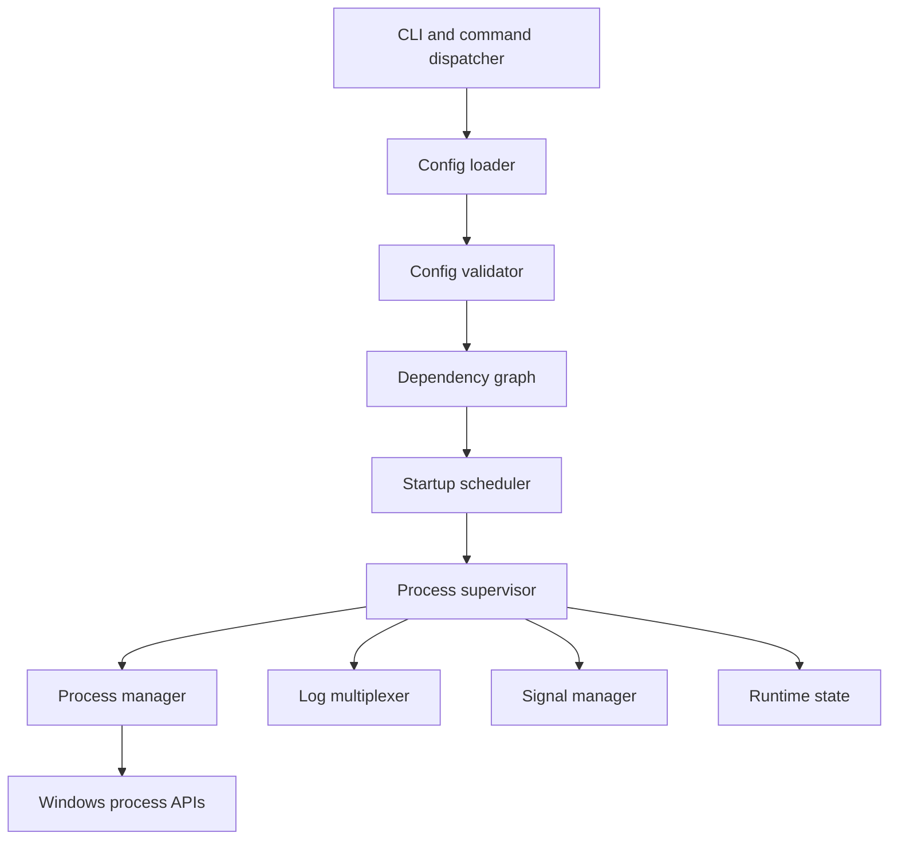
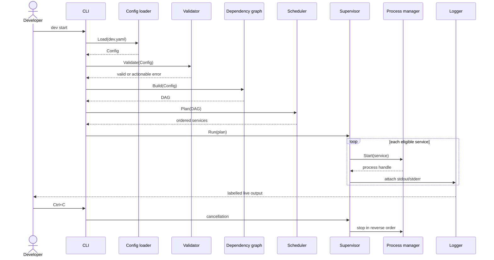
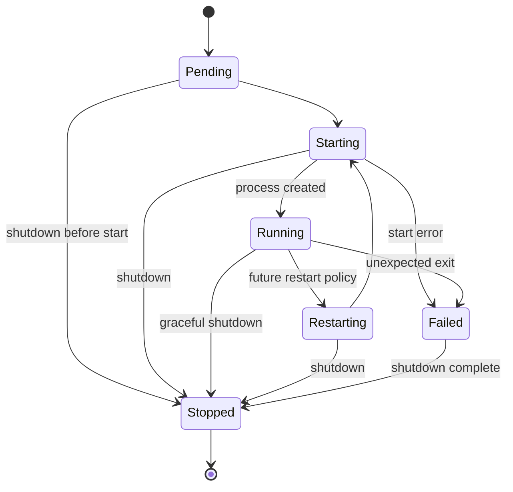

# Dev Orchestrator architecture

**Status:** approved baseline for v0.1  
**Target:** Windows-first Go CLI to run a local development stack from `dev.yaml`.

## Product boundary

The tool replaces multiple terminals and remembered startup order. It starts configured commands, presents their output, and stops them cleanly.

It is not a production process manager, container runtime, CI/CD system, service installer, or privilege-management tool.

```text
dev start
  -> load dev.yaml
  -> validate before doing anything
  -> determine dependency order
  -> start services in that order
  -> stream labelled logs
  -> stop every started service on Ctrl+C
```

## Principles

- One package has one primary responsibility.
- A configuration error starts no process.
- The scheduler decides; the process package executes.
- Lifecycle state belongs to the supervisor, not the CLI or logger.
- User-facing failures are actionable; internal errors retain causes for diagnostics.
- Configuration is untrusted input, even when committed to the repository.
- Prefer direct executable execution. Shell execution is explicit and deferred.
- Future features are additions to stable boundaries; v0.1 contains no speculative infrastructure.

## Component model



| Component | Owns | Must not own |
| --- | --- | --- |
| `cli` | commands, flags, terminal presentation, exit codes | configuration rules or lifecycle |
| `config` | YAML decoding, defaults, source locations | execution or dependency validation |
| `validator` | structural and semantic checks | scheduling or process creation |
| `dependency` | DAG, cycle detection, startup and reverse shutdown order | process execution |
| `scheduler` | eligible services and their order | launching processes |
| `supervisor` | lifecycle coordination, failure propagation, shutdown | command parsing or raw YAML |
| `process` | child creation, environment, working directory, tree stop | restart policy or dependency decisions |
| `logger` | concurrent stdout/stderr collection and labelled output | lifecycle decisions |
| `signals` | Ctrl+C/Ctrl+Break cancellation translation | direct service control |
| `state` | valid transitions and snapshots | OS process manipulation |

Dependencies remain inward: lower-level packages never import `cli`. `process`, `logger`, and `signals` expose small interfaces consumed by `supervisor`.

## `dev start` sequence



## Service lifecycle

Each service has exactly one state. The state manager rejects invalid transitions and exposes read-only snapshots.



v0.1 implements `Pending`, `Starting`, `Running`, `Failed`, and `Stopped`. `Restarting` is reserved but has no automatic policy yet.

## UX contract

- `dev start` defaults to `./dev.yaml`; `--file` selects another file.
- Validate all configuration before launching a child process.
- Show service, outcome, and the next useful action on failure.
- Prefix every line with timestamp, service, and stream (`OUT`/`ERR`). Colour is never the sole distinction.
- Never show stack traces for ordinary user errors; `--debug` may expose diagnostics.
- Ctrl+C announces shutdown and stops services in reverse dependency order.
- Exit codes: `0` clean completion; `1` configuration/user error; `2` runtime/startup failure; `130` interruption after shutdown handling.

## Security and Windows rules

- Treat config, arguments, paths, and inherited environment values as untrusted.
- Default command is one executable plus an argument list; never parse it through `cmd.exe` or PowerShell.
- A future `shell: true` escape hatch must be explicit and documented as unsafe; it is out of scope for v0.1.
- Resolve and validate working directories; never silently fall back to the current directory.
- Never request elevation, edit registry/firewall/PATH, install services, or modify machine-wide settings.
- Do not print environment values. Redact names such as `*_TOKEN`, `*_SECRET`, `*_PASSWORD`, and `*_KEY` in diagnostics.
- Stop only processes created and tracked by this run. Use Windows job objects or equivalent ownership; never kill by image name.

## Package layout

```text
